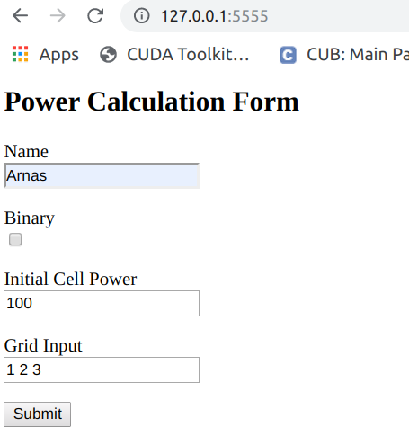
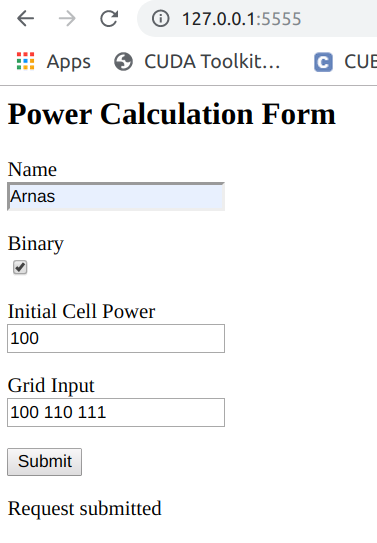
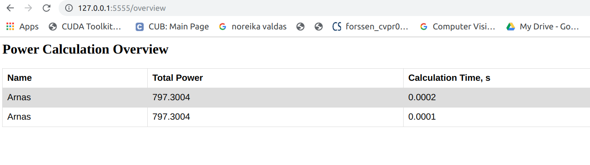

# Task1

Usage:
```bash
$ python3 task1.py initial_energy N [N ...]
```
Example:
```bash
$ python3 task1.py 100 1 2 3

$ python3 task1.py 100 10 100 3 1
```
# Task2

Usage:

```bash

$ python3 task2.py initial_energy N [N ...] [--binary]
```
Example:
```bash
$ python3 task2.py 100 1 2 3

$ python3 task2.py 100 100 110 111 --binary
```

# Task3 (using flask, rq, redis)

First run a RQ worker in a separate terminal:
```bash
$ rq worker
```
Then run the task3 application:
```bash
$ python3 task3.py
````
Open http://127.0.0.1:5555/ in your web browser

Enter the desired values as shown in the examples





The results can be viewed at:

http://127.0.0.1:5555/overview



Note: Tested on Ubuntu 16.04 LTS with Python 3.7.8
